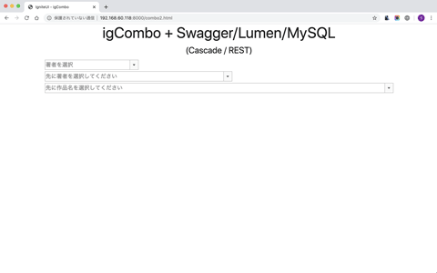
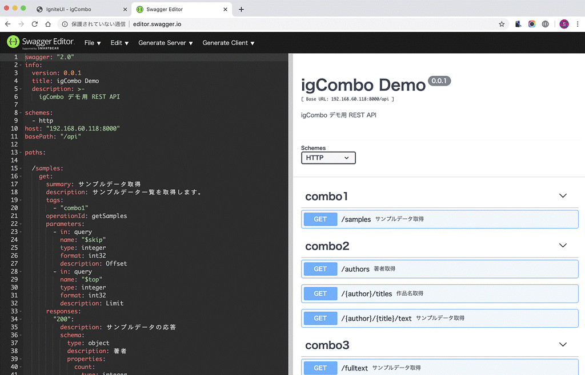

# igsample-igcombo-swagger

[Ignite UI for JavaScript](https://jp.infragistics.com/products/ignite-ui) の igCombo コンボボックスコンポーネントを利用して、Swagger(OpenAPI) 仕様で定義した REST API を、PHP と [Lumen](https://lumen.laravel.com/) (Laravel) フレームワークを利用したサーバアプリを構築し、MySQL データベースのデータを利用する、典型的な LAMP における Web API のサンプルです。
このサンプルの目的は、igComboの性能などをご紹介するとともに、既存システムに多い PHP や MySQL の利用環境において、Ignite UI for JavaScript をどのように活用できるかをご紹介します。



## 前提条件

本サンプルを実行するにあたり、以下の環境をご用意ください。

- [PHP](https://www.php.net/downloads)をインストールしたローカル環境 (比較的新しい7.xバージョン / OSは問いません)
- PHPと併せて[Composer](https://getcomposer.org/)をインストール
- PHPから利用できる[MySQL](https://www.mysql.com/jp/downloads/)環境 (Fulltext Indexが利用できる 5.7 以降を推奨)
- Chrome、Edge Chromium (できる限り新しいバージョン)

## 01_sampledataフォルダ

この配布コードを実行するのにあたって、検索情報のサンプルとしてご利用いただくための初期データを、ご利用のMySQLデータベースに格納するためのソースです。
なお、サンプルデータについて[青空文庫](https://www.aozora.gr.jp/)の情報を利用しています。本サンプルコードではその「取り扱い規準」に準拠しておりますが、本サンプルのご利用環境におけるデータの使用などには十分ご留意ください。

#### sample.sql
サンプルコードを実行するのにあたっての読み出し元となるデータベースのテーブルスキーマおよびNgramデータを書き込むための関数定義です。
MySQLにてこの内容を実行してください。
なお、データベース名を「demo」としていますが適宜ご利用の環境に合わせてください。
  - "sample"テーブル : title(作品名)、author(著者)、text(文書内の文章1行)といったレコードを格納します。
  - "sample_ngram"テーブル : textの情報を、n=2のN-gram(bi-gram)に分割したテキスト text_bigramを格納するためのテーブルです。
  - "func_get_bigram"関数 : 文字列を bi-gram に文字列に変換するための関数です。
```(SQL)
INSERT INTO `sample_ngram`
  (`id`, `title`, `author`, `text`, `text_bigram`)
  SELECT s.id, s.title, s.author, s.text, func_get_bigram(s.text)
    FROM `sample` AS s
;
```

#### importdata.php
青空文庫のデータをMySQLに格納するためのPHPコマンドラインアプリです。
実行にあたって、PHPの拡張モジュール mysqli、curl、mbstring、zip が利用できる必要があります。
```
$ php importdata.php
```

## 02_restapiフォルダ
REST APIとして動作させるためのPHPサーバアプリのコードです。
なお、実行にあたってはローカルに保存したdemoディレクトリにて、以下のように実行して、ローカルサーバを起動します。
```
$ cd demo
$ composer install
...
$ php -S localhost:8000 -t public
PHP 7.3.14 Development Server started at Sat May 16 19:45:23 2020
Listening on http://localhost:8000
Document root is /root/demo/public
Press Ctrl-C to quit.
```
ローカルサーバが起動後、ブラウザで http://localhost:8000 などにアクセスすると、インストールされているLumenバージョンを確認することができます。

#### swagger.yml
OpenAPI仕様バージョン2(OAS2)の仕様に従った、REST API仕様の定義です。
[Swagger Editor](https://editor.swagger.io/)などを利用してその内容を確認したり、同ツールの試行機能を利用して、実行しているREST APIの実行を確認することができます。


APIは「combo1」「combo2」「combo3」と3つのタグに分かれており、それぞれ後述のPHPサーバアプリのHTMLやLaravelコントローラモジュールの名称と関連しています。

#### demo/public/combo*.html

  - combo0.html : 静的なJSONファイル(demo/public/sample.json ※10万行近いデータなので、開く際はご注意ください。)をigComboの仮想化(virtualization)によって開くサンプルです。virtualizationを無効にしたり有効にするなど試行すると、そのパフォーマンスの違いが確認できます。
  - combo1.html : REST APIを通して、10万レコードを一度にすべて読み込まず、少しづつ遅延読み込みするサンプルです。LumenのComboaApi.phpコントローラに対応しています。
  - combo2.html : REST APIを通して、igCombo をカスケード利用するサンプルです。著者、作品と段階的に絞り込むことができます。
  - combo3.html : 10万レコードの文章の中から文字列の中間一致によるフィルタリングを、Ngramパーサーによる全文検索を利用して実現する実例をご紹介しています。

#### demo/app/Http/Controllers/Combo*Api.php
それぞれcombo*.htmlに対応したREST API実装です。
なお、ルーティングの定義は demo/routes/web.php に記述しております。
